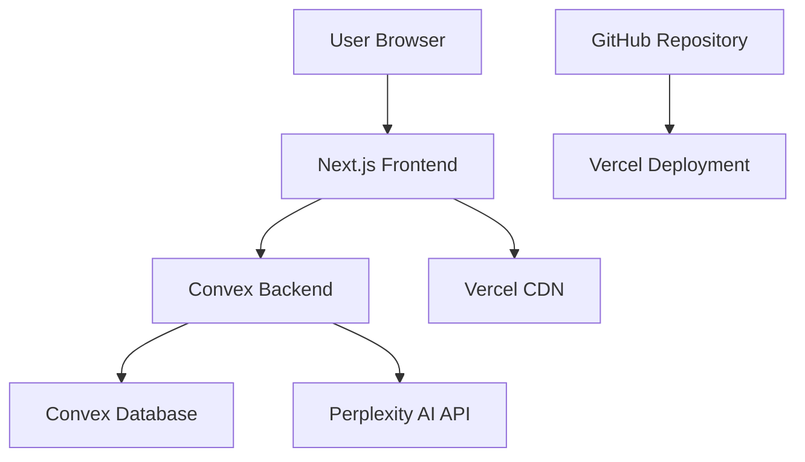

# Design Document

## Overview

CurateBang is architected as a modern, serverless web application using Next.js 14 with a real-time backend powered by Convex. The design emphasizes minimalism, performance, and developer experience while providing a robust content generation platform.

The application follows a clean architecture pattern with clear separation between presentation, business logic, and data layers. The frontend uses React with TypeScript for type safety, while Convex handles authentication, database operations, and AI integration seamlessly.

## Architecture

### High-Level Architecture



### Technology Stack Rationale

- **Next.js 14**: Provides excellent developer experience, built-in optimization, and seamless deployment to Vercel
- **Convex**: Eliminates the need for separate API development, provides real-time capabilities, and handles authentication natively
- **TypeScript**: Ensures type safety across the entire application stack
- **Tailwind CSS**: Enables rapid, consistent styling while maintaining the minimalist aesthetic
- **Perplexity API**: Provides high-quality AI content generation with platform-specific optimization capabilities

## Components and Interfaces

### Frontend Components

#### Core Layout Components

- **`app/layout.tsx`**: Root layout with Inter font, global styles, and Convex provider setup
- **`components/Header.tsx`**: Fixed header with CurateBang branding and GitHub link
- **`components/ui/Button.tsx`**: Reusable button component with consistent styling
- **`components/ui/Card.tsx`**: Content display card component

#### Authentication Components

- **`app/(auth)/login/page.tsx`**: Login form with email/password and Google OAuth options
- **`app/(auth)/signup/page.tsx`**: Registration form with validation
- **`components/AuthForm.tsx`**: Shared authentication form logic

#### Dashboard Components

- **`app/(dashboard)/page.tsx`**: Main dashboard layout and state management
- **`components/PromptInput.tsx`**: Text input with validation and character counting
- **`components/PlatformSelector.tsx`**: Toggleable platform selection interface
- **`components/GenerateButton.tsx`**: Action button with loading states
- **`components/ContentCard.tsx`**: Individual content display with copy functionality
- **`components/GenerationHistory.tsx`**: Historical content display and management

### Backend Schema and Functions

#### Database Schema

```typescript
// convex/schema.ts
export default defineSchema({
  users: defineTable({
    email: v.string(),
    name: v.optional(v.string()),
    image: v.optional(v.string()),
    tokenIdentifier: v.string(),
  }).index("by_token", ["tokenIdentifier"]),
  
  generations: defineTable({
    userId: v.id("users"),
    prompt: v.string(),
    platforms: v.array(v.string()),
    results: v.array(v.object({
      platform: v.string(),
      content: v.string(),
    })),
    createdAt: v.number(),
  }).index("by_user", ["userId"]),
});
```

#### Convex Functions

- **`convex/users.ts`**: User management queries and mutations
- **`convex/generations.ts`**: Content generation queries and mutations
- **`convex/actions.ts`**: AI integration and external API calls

## Data Models

### User Model

```typescript
interface User {
  _id: Id<"users">;
  email: string;
  name?: string;
  image?: string;
  tokenIdentifier: string;
}
```

### Generation Model

```typescript
interface Generation {
  _id: Id<"generations">;
  userId: Id<"users">;
  prompt: string;
  platforms: string[];
  results: {
    platform: string;
    content: string;
  }[];
  createdAt: number;
}
```

### Platform Configuration

```typescript
interface PlatformConfig {
  id: string;
  name: string;
  maxLength: number;
  promptTemplate: string;
  characteristics: string[];
}
```

## Error Handling

### Frontend Error Handling

- **Input Validation**: Real-time validation for prompt length and platform selection
- **API Error Display**: User-friendly error messages for failed generations
- **Loading States**: Clear feedback during async operations
- **Fallback UI**: Graceful degradation for network issues

### Backend Error Handling

- **Authentication Errors**: Proper HTTP status codes and error messages
- **API Rate Limiting**: Graceful handling of Perplexity API limits
- **Database Errors**: Transaction rollback and error logging
- **Validation Errors**: Input sanitization and validation at the API level

### Error Recovery Strategies

- **Retry Logic**: Automatic retry for transient API failures
- **Offline Support**: Local storage for draft prompts
- **Error Boundaries**: React error boundaries to prevent app crashes
- **Monitoring**: Error tracking and performance monitoring

## Testing Strategy

### Unit Testing

- **Component Testing**: React Testing Library for UI components
- **Function Testing**: Jest for utility functions and business logic
- **Hook Testing**: Custom hook testing with React Testing Library
- **Validation Testing**: Input validation and form handling

### Integration Testing

- **API Testing**: End-to-end testing of Convex functions
- **Authentication Flow**: Complete auth flow testing
- **Content Generation**: AI integration testing with mocked responses
- **Database Operations**: CRUD operation testing

### End-to-End Testing

- **User Journeys**: Complete user workflows from login to content generation
- **Cross-Browser Testing**: Compatibility across modern browsers
- **Mobile Responsiveness**: Touch interaction and responsive design testing
- **Performance Testing**: Load time and interaction performance

### Testing Tools

- **Jest**: Unit and integration testing framework
- **React Testing Library**: Component testing utilities
- **Playwright**: End-to-end testing framework
- **MSW**: API mocking for testing

## Security Considerations

### Authentication Security

- **Convex Auth**: Built-in security with JWT tokens
- **OAuth Integration**: Secure Google OAuth implementation
- **Session Management**: Automatic token refresh and secure storage

### API Security

- **Environment Variables**: Secure API key storage
- **Rate Limiting**: Protection against API abuse
- **Input Sanitization**: XSS and injection prevention
- **CORS Configuration**: Proper cross-origin request handling

### Data Protection

- **User Data Encryption**: Sensitive data encryption at rest
- **Privacy Compliance**: GDPR-compliant data handling
- **Audit Logging**: User action tracking for security monitoring

## Performance Optimization

### Frontend Performance

- **Code Splitting**: Dynamic imports for route-based splitting
- **Image Optimization**: Next.js automatic image optimization
- **Caching Strategy**: Aggressive caching of static assets
- **Bundle Analysis**: Regular bundle size monitoring

### Backend Performance

- **Database Indexing**: Optimized queries with proper indexes
- **Caching Layer**: Convex built-in caching for frequently accessed data
- **API Optimization**: Efficient Perplexity API usage patterns
- **Real-time Updates**: Optimistic updates for better UX

### Deployment Performance

- **Vercel Edge Network**: Global CDN for fast content delivery
- **Serverless Functions**: Auto-scaling backend functions
- **Build Optimization**: Optimized production builds
- **Monitoring**: Performance monitoring and alerting

## UI/UX Design Principles

### Visual Design

- **Color Scheme**: Strict adherence to defined color palette
  - Background: #FFFFFF
  - Primary Text: #1A202C
  - Accent: #2B6CB0
  - Highlight: #81E6D9
  - Secondary Text: #4A5568
- **Typography**: Inter font family for clean, professional appearance
- **Spacing**: Generous white space for minimalist aesthetic
- **No Visual Clutter**: Elimination of shadows, gradients, and unnecessary effects

### Interaction Design

- **Intuitive Navigation**: Clear, logical user flow
- **Immediate Feedback**: Visual confirmation for all user actions
- **Progressive Disclosure**: Information revealed as needed
- **Accessibility**: WCAG 2.1 AA compliance for inclusive design

### Responsive Design

- **Mobile-First**: Optimized for mobile devices with progressive enhancement
- **Flexible Layouts**: CSS Grid and Flexbox for adaptive layouts
- **Touch-Friendly**: Appropriate touch targets and gestures
- **Cross-Device Consistency**: Uniform experience across devices
